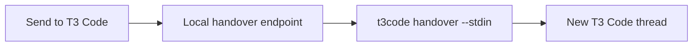

# @bvdm/t3code-cli

`t3code` hands the current folder or Git repository to a new thread in [T3 Code](https://github.com/pingdotgg/t3code), and lets agents, scripts, and apps outside T3 discover, read, message, and steer existing threads.

It connects to the running local T3 server. For a handover, it resolves the workspace against T3 projects, optionally creates the missing project, and launches a thread with its first prompt in one durable call. For existing threads, it lists, reads, sends messages, and waits for replies. It also changes models, providers, effort, and modes, interrupts turns, answers approvals and questions, manages the message queue, forks and merges threads back, runs scheduled tasks, and settles or reopens threads.

## Requirements and versions

This version needs a T3 Code build with orchestrator V2, which reports orchestration protocol 2. Builds before orchestrator V2 speak protocol 1; use `@bvdm/t3code-cli@0.2` for those. The CLI checks the protocol before it signs in and stops with `T3_PROTOCOL_UNSUPPORTED` when the server speaks another one.

You also need Node.js 22.16+ on the 22 line, 23.11+ on the 23 line, or 24.10+.

## Install

```bash
npm install --global @bvdm/t3code-cli
```

Then verify discovery and the active T3 server:

```bash
t3code --json doctor
```

## Develop locally

```bash
pnpm install
pnpm check
npm link
```

`pnpm check` runs typechecking, tests, and the build. Then verify the linked command with `t3code --json doctor`.

## Where the CLI fits next to T3's own tools

Orchestrator V2 gives every agent that T3 runs a `t3-code` MCP toolkit: it can launch, message, wait for, read, fork, and delegate to threads by itself. T3 mints those tools' credentials for each thread's provider session, so only agents inside a T3 thread can use them. The CLI covers the rest:

- Agents, scripts, and apps outside T3, such as a coding agent in a terminal, a webhook handler, or an app's **Send to T3 Code** button.
- Agents inside T3 that need what the MCP tools leave out: threads in other projects, transcripts sliced by turn, waiting for a reply, refusing to send into a busy thread, dismissing a stale question.
- People and supervisors who approve or decline another thread's requests or change its permission or plan mode. The MCP tools never do that, by design. Give these commands to an agent only when you would let it act with your authority. An agent in a restricted permission mode has to get each CLI call approved in T3 first.

Inside a T3 thread, prefer the MCP tools for your own project and use the CLI for the gaps.

## Handover

From any folder in a repository:

```bash
t3code handover --prompt "Continue from this handover..."
```

`threads create` accepts the same options as `handover` and runs the same flow.

When `--cwd` is omitted, the command starts from the process's current working directory. In the default `repo` workspace mode, that folder then resolves to its Git root.

For larger prompts, pass stdin so shell command-length and quoting rules do not matter:

```bash
printf '%s' "Continue from this handover..." | t3code handover --stdin
```

PowerShell:

```powershell
'Continue from this handover...' | t3code handover --stdin
```

The default behavior is:

- resolve the Git repository root (`workspaceMode: "repo"`); a linked worktree, such as one T3 created for another thread, resolves to the main checkout's project, and a `current` checkout handover keeps the new thread in that worktree;
- create a missing T3 project (`projectPolicy: "create"`);
- resolve T3's checkout preference in the same order as the app: project setting, checked-in `t3.json`, then the global setting;
- use the project's saved model selection, including provider options, or T3's own default model when the project has none;
- use full access for the new thread;
- launch the thread, prepare its workspace, and start the prompt in one call to T3's `orchestration.launchThread`;
- reveal T3 Code after the launch.

T3 records each launch step under the launch's command id. A launch that fails partway is either finished or cleaned up by T3, and `THREAD_START_FAILED` reports `cleanup: "server-managed"` with that id.

Add `--wait` to wait for the first turn and print its reply. That makes a handover usable as a one-shot task for another model:

```bash
printf '%s' "Review the diff on this branch and list risks." \
  | t3code --json handover --stdin --open none --checkout current --provider codex --model gpt-6-astra --wait --timeout 900
```

Use `--dry-run --json` to inspect the exact project mutation and launch input without changing T3 state.

Select the new thread's controls on the handover command:

```bash
t3code handover \
  --provider codex \
  --model gpt-6-astra \
  --speed fast \
  --thinking-effort xhigh \
  --permission full-access \
  --mode build \
  --checkout current \
  --prompt "Continue from this handover..."
```

| Control | Values |
| --- | --- |
| `--provider` | A configured T3 provider instance id, such as `codex` or `claudeAgent` |
| `--model` | A model slug supported by that provider instance |
| `--speed`, `--speed-mode` | `standard`, `fast` |
| `--thinking-effort` | A model-supported value such as `low`, `medium`, `high`, `xhigh` or `max` |
| `--permission`, `--runtime-mode` | `approval-required`, `auto-accept-edits`, `full-access` |
| `--mode`, `--interaction-mode` | `build`/`default`, `plan` |
| `--checkout`, `--env-mode` | `current`/`local`, `worktree`, or T3's configured default via `t3` |

Command flags override the CLI config, which overrides the T3 project's saved model selection. Speed and thinking effort are stored as model options; T3 applies the option ids supported by the selected provider and model. If `--provider` changes the provider instance, also pass `--model`, because provider instance ids can be user-defined and do not imply a model.

`--checkout worktree` asks T3 for a new worktree from the current branch, with a temporary `t3code/<hex>` branch that T3 renames once the thread has a title. T3 runs the project's setup script as part of the launch. Worktrees start from origin unless T3's `newWorktreesStartFromOrigin` setting is off. A folder without a current branch returns `WORKTREE_REQUIRES_BRANCH` instead of silently falling back to the current checkout.

## Projects

```bash
t3code projects list
t3code projects resolve --cwd .
t3code projects ensure --cwd . --project-policy create --dry-run
```

`projects list` shows active projects with their ids, workspace roots, and titles. `projects resolve` finds the existing project for a folder without creating one. If no project matches, it reports that and returns `project: null` in JSON.

`projects ensure` returns the existing project or creates one when the project policy is `create`, the default. `--project-policy existing` makes a missing project an error. `--dry-run` previews the result without creating the project.

Both `resolve` and `ensure` default to the current working directory and accept `--cwd <path>` and `--workspace-mode repo|folder`. Project discovery reads T3's local projection database (`statev2.sqlite`) read-only and falls back to T3's `/api/projects` when the file is unavailable.

## Models

```bash
t3code models list
t3code models list --provider codex
```

`models list` shows T3's configured provider instances, their models, and model options such as reasoning effort. Human-readable output summarizes providers with more than 40 models. Use `--provider <instance-id>` to select one provider instance and expand its full model list. JSON includes the full catalog for the selected providers.

## Existing threads

T3 thread ids are UUIDs, or ids that start with `thread:` when T3 minted them itself. Always pass the exact id.

List threads across projects, or restrict discovery by project id or workspace:

```bash
t3code threads list
t3code threads list --status active --cwd .
t3code threads list --status settled --project <project-id>
```

`--status` accepts `active`, `settled`, or `all` (the default). Results include the exact thread id, project, title, model, update time, the lifecycle `status`, and `runStatus`, which is what its latest turn is doing. Inspect the exact target before sending:

```bash
t3code threads inspect --thread <thread-id>
```

`inspect` prints the workspace and branch, model, turn count, the running or latest turn, queued messages, and any approval or question the thread waits on. Its JSON also holds `activeRun`, `latestRun`, `queue`, and the 6 most recent messages, with message text limited to 2,000 characters.

### Read a thread

`read` prints a Markdown transcript grouped by turn, which an agent can read directly:

```bash
t3code threads read --thread <thread-id>
t3code threads read --thread <thread-id> --detail answers --turns 3 --first-turn
t3code threads read --thread <thread-id> --detail full --last-turn --max-chars 1500
t3code --json threads read --thread <thread-id>
```

`--detail` sets how much of each turn to return:

- `answers`: the user's prompts and the turn's final answer.
- `messages` (default): prompts and every assistant message, without reasoning or tool calls.
- `full`: everything, including reasoning, tool calls, approvals and questions, and changed files.

A plan-mode turn's proposed plan is its answer, so it appears at every level.

`--turns <n>` keeps the last n turns, and `--last-turn` is short for `--turns 1`. `--first-turn` adds the first turn, which holds the original request. `--max-chars <n>` clips each message and tool entry but keeps its start and end. Without it, message text is never shortened.

Each turn is one of T3's runs, so every message belongs to exactly one turn. Messages queued behind a running turn show as `Queued` sections at the end. Threads that started before orchestrator V2 keep their earlier messages but lost their tool calls, plans, and checkpoints in T3's migration; those turns show as `imported`.

The JSON result keeps `data.thread.messages` in turn order and adds `turnIndex` and `textTruncated` to each message. `data.thread.turns` describes each returned turn: its number, run id (`turnId`), `state`, raw `runStatus`, final message id, and, in `full` detail, its changed files and tool call count. `state` is `running`, `completed`, `interrupted`, `error`, `pending` (queued), `rolled_back`, or null for imported history. `data.thread.view` reports the detail level and how many turns were returned or left out. `full` also returns `data.thread.toolCalls` and `data.thread.proposedPlans`.

### Send a message

Start a new turn on that thread with one of `--prompt`, `--prompt-file`, or `--stdin`:

```bash
printf '%s' "Review findings from the other thread..." \
  | t3code threads send --thread <thread-id> --stdin
```

Sending to a settled thread requires confirmation, because T3 wakes a settled thread on any new message. Non-interactive and JSON callers must opt in with `--wake-settled`:

```bash
printf '%s' "New findings that require more work..." \
  | t3code --json threads send --thread <thread-id> --stdin --wake-settled
```

The send command does not report success from the dispatch alone. It waits until T3 records the exact message. Archived threads are rejected.

A thread is busy while a turn runs or while queued messages wait for their turn. By default `send` refuses a busy thread with `THREAD_BUSY` and dispatches nothing; `error.details` names the running turn and the queue length. Choose another behavior with `--if-busy`:

| `--if-busy` | Effect |
| --- | --- |
| `refuse` (default) | Send nothing. The older name `reject` still works. |
| `queue` | Add the message to T3's queue. It starts its own turn when the running one ends. |
| `steer` | Send the message into the running turn. The older name `inject` still works. |
| `restart` | Stop the running turn and start a new one with this message. |

With only queued messages and no running turn, `steer` and `restart` queue the message too. The busy check is a snapshot, not a lock, so callers that send to the same thread at once must take turns themselves.

Add `--wait` to wait for the turn that handles the message and print its reply:

```bash
printf '%s' "Which tests still fail?" \
  | t3code --json threads send --thread <thread-id> --stdin --wait --timeout 540
```

`data.wait.outcome` is one of:

- `completed` or `interrupted`: `data.reply` holds that turn as a transcript, without your own message.
- `error`: the provider could not run the turn; `data.wait.error` says why.
- `needs-attention`: the turn waits for an approval or an answer, listed in `data.pendingRequests`.
- `queue-held`: the message waits in a queue that T3 holds after a restart. Resume it with `threads queue resume`.
- `ended`: the turn was rolled back.

When the wait times out, the command fails with `THREAD_WAIT_TIMEOUT` and `error.details.sent: true`. Do not resend the message; keep waiting with `threads wait`.

To wait for whatever a thread is doing, for example after a handover:

```bash
t3code threads wait --thread <thread-id> --timeout 540
```

It returns when the running turn and every queued message are done, or when the thread needs a person. Both waits default to 600 seconds. A waiting command issues its T3 session for the timeout rounded up to whole minutes plus two minutes, and revokes it when it ends.

### Change a thread's model, provider, and modes

`threads set` changes an existing thread's settings without sending a message. `threads send` takes the same flags and applies them before the message's turn starts:

```bash
t3code threads set --thread <thread-id> --thinking-effort xhigh --speed fast
t3code threads set --thread <thread-id> --model gpt-6-astra --mode plan
t3code threads set --thread <thread-id> --provider claudeAgent --model claude-opus-5-5
t3code threads set --thread <thread-id> --option contextWindow=1m --dry-run
```

`--thinking-effort` and `--speed` set whichever option the model uses for them:

- Codex: `reasoningEffort`, and `serviceTier`, where fast is `priority`.
- Claude: `effort` and `fastMode`. Only Opus models have fast mode.
- Grok: `reasoningEffort`. OpenCode: `variant`.

`--option id=value` sets any other model option. The CLI checks every value against T3's model catalog, which `t3code models list` prints. When the model changes, settings the new model supports carry over and the rest are dropped.

A model on another provider instance goes through T3's provider switch: T3 hands the conversation to the new provider with a budgeted share of its history, in the same thread. A provider switch or a permission change restarts the provider session, so the CLI refuses both while a turn runs. `send` with new settings also requires an idle thread, because the message would otherwise run with the old settings.

### Interrupt, approve, and answer

```bash
t3code threads interrupt --thread <thread-id>
t3code threads approve --thread <thread-id> --scope session --wait
t3code threads decline --thread <thread-id> --cancel
t3code threads answer --thread <thread-id> --answer "Keep a Changelog" --wait
t3code threads answer --thread <thread-id> --answer 1=main --answer 2=lint
t3code threads answer --thread <thread-id> --dismiss
```

`inspect` and `wait` list the approvals and questions a thread waits for, with their request ids. With one pending request the commands pick it; with several, pass `--request <request-id>`.

- `interrupt` stops the running turn. It refuses an idle thread, because interrupting Claude stops its whole session. A queued message starts once the turn stops.
- `approve` accepts once by default. `--scope session` keeps the approval for the rest of the session. `--scope always` works only when the request offers it.
- `decline` denies the request and lets the agent continue. With `--cancel`, Codex also stops the turn.
- `answer` matches each answer to the question's options by label or value, and otherwise sends it as free text when the question allows that. Prefix answers with the question number when a request asks several. Some questions outlive their turn: answering one starts a new turn, which `--wait` follows.
- `answer --dismiss` closes a question that no running turn waits on, such as one whose provider session is gone. A request from a session that is gone cannot take an answer (`REQUEST_NOT_ANSWERABLE`).

Each command waits until T3 shows the request resolved. With `--wait`, it then waits for the thread like `threads wait`. If that wait times out, the error carries `responded: true`: the response already went through, so do not send it again.

### Settle or reopen

```bash
t3code threads settle --thread <thread-id>
t3code threads unsettle --thread <thread-id>
```

`settle` refuses a thread with a running turn, queued messages, or a pending approval or question. `unsettle` marks the thread manually active but does not start a turn. T3 also settles idle threads by itself; that is configurable in T3. Both commands require the `threadSettlement` capability and wait until T3 shows the change.

## Forks and merge-back

```bash
t3code threads fork --thread <thread-id>
t3code threads fork --thread <thread-id> --from turn:3 --title "Try the other approach" --open none
t3code threads merge-back --thread <fork-id>
t3code threads merge-back --thread <fork-id> --into <thread-id> --from turn:2
```

`fork` creates a new thread that continues from a point in another thread. `--from` picks the point. `latest`, the default, is the latest completed turn. `turn:<n>` uses the turn numbers that `threads read` prints, and a run or checkpoint id from `threads read --json` works too. An explicit turn can be completed, interrupted, or failed. The new thread has no turns yet: T3 gives it the source thread's context with its first message. The command waits until the new thread exists, then opens it like a handover, following `--open` or the `openMode` setting.

`merge-back` hands a fork's work to another thread. Without `--into`, that is the thread the fork came from; a thread that is not a fork fails with `THREAD_NOT_A_FORK`. Merging back does not start a turn. The target thread receives the fork's work with its next turn. T3 only merges a completed turn, so it refuses a fork that has no finished turns yet.

## The message queue

Messages sent with `--if-busy queue` wait in the thread's queue until the running turn ends.

```bash
t3code threads queue list --thread <thread-id>
printf '%s' "Also check the migration." \
  | t3code threads queue edit --thread <thread-id> --run <run-id> --stdin
t3code threads queue move --thread <thread-id> --run <run-id> --before <other-run-id>
t3code threads queue move --thread <thread-id> --run <run-id> --before end
t3code threads queue cancel --thread <thread-id> --run <run-id>
t3code threads queue promote --thread <thread-id> --run <run-id>
t3code threads queue resume --thread <thread-id>
```

`list` prints each message's position, run id, whether it is held, and its text. Pass that run id to `--run`. `promote` sends a queued message into the running turn instead of waiting, and refuses when no turn runs. After a restart, T3 holds the queue until someone resumes it. `resume` releases it and refuses a queue that is not held. Each command waits until T3 shows the change.

## Search and organize threads

```bash
t3code threads search --query "pricing table" --limit 10
t3code threads pin --thread <thread-id>
t3code threads unpin --thread <thread-id>
t3code threads snooze --thread <thread-id> --until 2h
t3code threads snooze --thread <thread-id> --until 2026-10-06T09:00:00+02:00
t3code threads unsnooze --thread <thread-id>
t3code threads archive --thread <thread-id>
t3code threads unarchive --thread <thread-id>
t3code threads rename --thread <thread-id> --title "Release notes"
```

`search` looks through the user and assistant messages of every thread. It prints the thread id, project, thread title, who wrote the message, and a snippet. The query needs 2 to 200 characters, and `--limit` accepts 1 to 50.

`snooze --until` takes an ISO time or a duration from now, such as `30m`, `2h`, or `1d`. T3 refuses to snooze a thread that has a queued message or waits for an approval or answer. Pinning a settled or snoozed thread makes it active again. Each command waits until T3 shows the change.

## Scheduled tasks

```bash
t3code schedules list
t3code schedules list --cwd .
printf '%s' "Triage new issues and label them." \
  | t3code schedules create --title "Issue triage" --stdin --at 09:00 --days weekdays --cwd .
t3code schedules create --title "Check in" --prompt "Any blockers?" --every 2h --thread <thread-id>
t3code schedules update --task <task-id> --at 08:30 --model gpt-6-astra
t3code schedules disable --task <task-id>
t3code schedules enable --task <task-id>
t3code schedules run --task <task-id>
t3code schedules delete --task <task-id>
```

A scheduled task sends a prompt on a schedule. `--every <duration>` repeats it, at most once a minute. `--at <HH:MM>` runs it at a time of day in the T3 server's local time, every day or on the `--days` you list: `mon,wed,fri`, `weekdays`, `weekends`, or `daily`.

Without `--thread`, each run starts a new thread with the task's title. The project comes from `--project <id>` or from `--cwd`, which resolves like `projects resolve` and defaults to the current folder. The CLI never creates a project for a schedule. By default each run works in the project checkout. `--checkout worktree` starts each run in a new worktree from the current branch of that folder, or of the project checkout with `--project`.

With `--thread`, each run sends the prompt to that thread. The task then belongs to the thread's project and keeps the thread's model.

For tasks that start new threads, the model follows the handover order: command flags, the CLI config, the project's saved model, then T3's default. The CLI checks the provider, model, effort, and speed against T3's catalog when it saves a task, because a bad model would otherwise fail later with nobody watching. Permission and mode default to the CLI config. `--disabled` saves a task that does not run until `schedules enable`.

`update` changes only the flags you pass, and `--days` alone keeps the task's time of day. `run` starts the task once, right away, even when it is disabled. It fails with `SCHEDULE_RUN_FAILED` when T3 could not start it. `delete` checks that the task is gone from T3's list.

## Global options

These options apply to every command:

| Option | Effect |
| --- | --- |
| `--json` | Emit JSON success and error envelopes instead of human-readable output. |
| `--config <path>` | Use this config file instead of `T3CODE_CLI_CONFIG` or the default location. |
| `--t3-home <path>` | Override `T3CODE_HOME` and the `t3Home` setting for this command. |
| `--origin <url>` | Override `T3CODE_CLI_ORIGIN` and the `origin` setting for this command. |
| `-V`, `--version` | Print the package version. |
| `-h`, `--help` | Show help for the command. |

An explicit origin is tried first during discovery. If it does not expose a T3 environment, discovery continues with local runtime files under the T3 home, checking `userdata` before `dev`.

## Settings

`config path` prints the selected config file's path. `config show` prints that path, whether the file exists, and the effective settings after defaults, environment variables, and global options have been applied. A missing config file uses defaults and environment overrides.

The config file location is selected in this order:

1. `--config <path>`.
2. `T3CODE_CLI_CONFIG`.
3. `%APPDATA%/t3code-cli/config.json` on Windows when `APPDATA` is set.
4. `$XDG_CONFIG_HOME/t3code-cli/config.json` when `XDG_CONFIG_HOME` is set, otherwise `~/.config/t3code-cli/config.json`.

Command flags take precedence over environment overrides, which take precedence over values in the config file, then built-in defaults. `T3CODE_HOME` overrides `t3Home`, and `T3CODE_CLI_ORIGIN` overrides `origin`. Other environment overrides use the `T3CODE_CLI_` prefix, such as `T3CODE_CLI_PROJECT_POLICY` and `T3CODE_CLI_WORKSPACE_MODE`.

`config set <key> <value>` writes every effective setting to the selected file, not only the one you change. Values that come from environment variables, `--t3-home`, or `--origin` at that moment are saved too.

```bash
t3code config path
t3code config show
t3code config set projectPolicy existing
t3code config set workspaceMode folder
t3code config set openMode browser
t3code config set threadEnvMode local
t3code config set provider codex
t3code config set model gpt-6-astra
t3code config set speedMode fast
t3code config set thinkingEffort xhigh
```

| Setting | Values | Default |
| --- | --- | --- |
| `projectPolicy` | `create`, `existing` | `create` |
| `workspaceMode` | `repo`, `folder` | `repo` |
| `openMode` | `auto`, `desktop`, `browser`, `none` | `auto` |
| `threadEnvMode` | `t3`, `local`, `worktree` | `t3` |
| `runtimeMode` | `approval-required`, `auto-accept-edits`, `full-access` | `full-access` |
| `interactionMode` | `default`, `plan` | `default` |
| `provider` | Configured T3 provider instance id | T3 project selection |
| `model` | Provider model slug | T3 project selection |
| `speedMode` | `standard`, `fast` | T3 project selection |
| `thinkingEffort` | Model-supported effort value | T3 project selection |
| `sessionTtl` | T3 auth session duration | `2m` |
| `t3Home` | Path to the T3 home directory | `~/.t3` |
| `origin` | T3 server URL | Discovered from local runtime files |

`projectPolicy: "existing"` makes a missing project a hard error. `workspaceMode: "folder"` uses the exact current folder instead of walking up to the Git root. `threadEnvMode: "t3"` follows T3's project → `t3.json` → global local/worktree preference. Explicit CLI config values remain overrides.

The config file also accepts `t3Command`, an array such as `["C:/tools/t3.exe"]` or `["node", "/path/to/bin.mjs"]`, which replaces the automatic search for the `t3` command described under [Security](#security).

## Commands

```text
t3code --json doctor
t3code config path
t3code config show
t3code config set <key> <value>

t3code projects list
t3code projects resolve --cwd .
t3code projects ensure --cwd . --project-policy create

t3code models list

t3code handover --stdin [--wait]
t3code threads create --stdin [--wait]
t3code threads list --status active --cwd .
t3code threads inspect --thread <thread-id>
t3code threads read --thread <thread-id> --detail answers --turns 3
t3code threads send --thread <thread-id> --stdin [--if-busy refuse|queue|steer|restart] [--wait]
t3code threads wait --thread <thread-id>
t3code threads set --thread <thread-id> --thinking-effort high --speed fast
t3code threads interrupt --thread <thread-id>
t3code threads approve --thread <thread-id>
t3code threads decline --thread <thread-id>
t3code threads answer --thread <thread-id> --answer <answer>
t3code threads settle --thread <thread-id>
t3code threads unsettle --thread <thread-id>
t3code threads fork --thread <thread-id> --from latest
t3code threads merge-back --thread <fork-id>
t3code threads queue list --thread <thread-id>
t3code threads search --query <text>
t3code threads pin --thread <thread-id>
t3code threads snooze --thread <thread-id> --until 2h
t3code threads archive --thread <thread-id>
t3code threads rename --thread <thread-id> --title <title>

t3code schedules list
t3code schedules create --title <title> --stdin --every 1h
t3code schedules update --task <task-id> --at 09:00
t3code schedules enable --task <task-id>
t3code schedules run --task <task-id>
t3code schedules delete --task <task-id>

t3code request get api/orchestration/shell
t3code help [command]
```

Every command supports human-readable output. `--json` writes `{ "ok": true, "data": ... }` to stdout on success and a stable error envelope to stderr on failure. When a failure wraps an error T3 returned, such as its reason for rejecting a launch or a command, the message carries T3's reason and `error.cause` carries the underlying error.

The CLI uses these exit codes:

| Code | Meaning |
| --- | --- |
| `0` | Success. |
| `1` | General failure, including configuration, discovery, or API errors. |
| `2` | Usage or validation error, such as `INVALID_USAGE`. |
| `3` | Missing target, such as a thread, pending request, project filter, or provider requested by `models list`. |
| `4` | Operation refused because of lifecycle state, confirmation, the server's protocol, or a rejected command or response. |
| `5` | A command was dispatched, but T3 did not show its result in time. |
| `6` | A thread wait timed out. |

Any command can fail with `1` or `2`, and usage errors use the same JSON error envelope. Check `error.code` for the specific failure.

`request get` sends T3's orchestration protocol header, so `api/orchestration/*` routes answer it. The leading slash of its path is optional. Git Bash rewrites arguments that start with a slash into Windows paths (`/api/...` becomes `C:/Program Files/Git/api/...`), so write `api/...` there or set `MSYS_NO_PATHCONV=1`.

Authenticated API requests use Node's native HTTP/HTTPS transport to avoid the bundled Undici parser crash on backpressured responses. Each request owns its connection and closes it after completion or failure. The 30-second deadline covers the response body too; truncated bodies return `T3_REQUEST_FAILED`. Redirects are reported as `T3_API_ERROR` rather than followed, and the client does not request compressed responses. Point `--origin` at the T3 server itself.

## Upgrading from 0.2

0.3 speaks orchestrator V2 only. Keep 0.2 installed for T3 builds before orchestrator V2. What changed for callers:

- **Sign-in.** The CLI no longer bundles the `t3` package. It runs the `t3` command that matches the server; see [Security](#security).
- **Turns are runs.** `turnId` is a run id, and every message belongs to its run. The V1 heuristics that assigned queued messages to turns are gone. `turns[].runStatus` and `imported` are new.
- **Thread state.** `inspect`, `read`, and `list` report `runStatus`, `activeRun`, `latestRun`, and `queue` instead of `session` and `latestTurn`. `contextWindow` is no longer reported.
- **Sending.** `--if-busy` accepts `refuse`, `queue`, `steer`, and `restart`; `reject` and `inject` still work. `data.message.delivery` names the delivery mode. `verification` carries the run that handles the message.
- **Waiting.** A wait ends on the first observation T3 reports, instead of after two matching polls and a grace window. `queue-held` is a new outcome.
- **Handover.** One `launchThread` call replaces thread creation, the first turn, and the worktree bootstrap. `data.thread.launch` holds the launch input; `createCommand`, `command`, and `dispatch` are gone. `--wait` is new.
- **Settings.** `threads set --provider` now switches a started thread to another provider through T3's handoff, instead of failing with `PROVIDER_SWITCH_UNSUPPORTED`. `sessionRestart` is gone.
- **Requests.** Approvals and answers go through T3's runtime requests. `REQUEST_NOT_ANSWERABLE` is new; `answer --dismiss` now covers any question that no running turn waits on.
- **New commands.** `threads fork`, `merge-back`, `queue`, `search`, `pin`, `unpin`, `snooze`, `unsnooze`, `archive`, `unarchive`, and `rename`, plus `schedules` for scheduled tasks.

## Agent skills

The package ships two skills for coding agents in `skills/`:

- `use-t3code-cli` covers setup, handovers, and the full command set.
- `t3thread` points an agent at an existing thread: `$t3thread <thread-id> <what to do>`. The agent inspects the thread and reads only as much as the instruction needs. It can brief you on the thread, answer questions about it, continue or review its work, or message it and wait for the reply. When you ask, it also changes the thread's model, provider, effort, or mode, stops a running turn, and answers the thread's approvals and questions.

Copy or link a skill folder into your agent's skills directory, such as `~/.claude/skills/` for Claude Code or `~/.agents/skills/` for Codex. A global npm install keeps them in `$(npm root -g)/@bvdm/t3code-cli/skills`.

## Origin and optional UI example

This CLI was initially developed for the [Delano viewer](https://github.com/MajesteitBart/delano). Delano's **Send to T3 Code** button lets someone hand browser context directly to a new thread in the T3 Code chat application.




The CLI is the product; a front end is not required. See the optional [integration README](integrations/README.md#why-delano-needed-it) for why Delano needed this handover button and how its browser-to-server-to-CLI flow works. That folder also contains a copyable React split button and Node bridge as one example of integrating `t3code` into another application.

## Desktop navigation

T3 Code registers `t3code://` but only uses a second launch to reveal its window; no T3 build opens a specific thread from a link yet. The CLI therefore creates the exact thread first and reports `opened.exactThread: false` when it can only reveal the desktop app. If a T3 build registers the proposed `t3://thread/<threadId>` protocol, `openMode: "auto"` uses it and reports `exactThread: true`. `openMode: "browser"` opens the exact local web route immediately.

## Security

The CLI signs in through T3's own `t3 auth session issue` command, keeps the bearer token only in memory, and revokes the session in a `finally` block. WebSocket calls exchange that token for a short-lived ticket. Tokens and tickets are never included in JSON output or logs.

A session only works when it is written to the database the running server reads, and that database differs between T3 versions. The CLI therefore looks for a `t3` command that matches the server, in this order:

1. `t3Command` from the CLI config.
2. The installed T3 Code desktop app whose version matches the server. The app's own executable runs its bundled `t3` as Node. The CLI caches each app's version until the executable changes, because asking costs about half a second.
3. `t3` on `PATH`.
4. `npx --yes t3@<server version>`, pinned to the server's exact version.

`doctor` reports which one it found under `checks.t3Cli` and whether its version matches the server.

## Publish a release

Pull requests and pushes run `pnpm check` through [GitHub Actions](.github/workflows/ci.yml) on the minimum supported Node 22 and Node 24 versions.

Publishing uses npm trusted publishing from [publish.yml](.github/workflows/publish.yml). Configure the package's **Trusted Publisher** once in the npm package settings:

| Field | Value |
| --- | --- |
| Provider | GitHub Actions |
| Organization or user | `MajesteitBart` |
| Repository | `t3code-cli` |
| Workflow filename | `publish.yml` |
| Environment | Leave empty |

The workflow uses short-lived OIDC credentials, so it does not need an `NPM_TOKEN` repository secret. It also publishes npm provenance automatically.

Choose `patch`, `minor`, or `major` to match the change. For a patch release:

```bash
npm version patch
git push --follow-tags
```

Then publish a GitHub Release for the new `v<package-version>` tag. The workflow verifies that the tag matches `package.json`, installs from the frozen lockfile, runs the complete `prepublishOnly` check, and publishes the public scoped package to npm.
