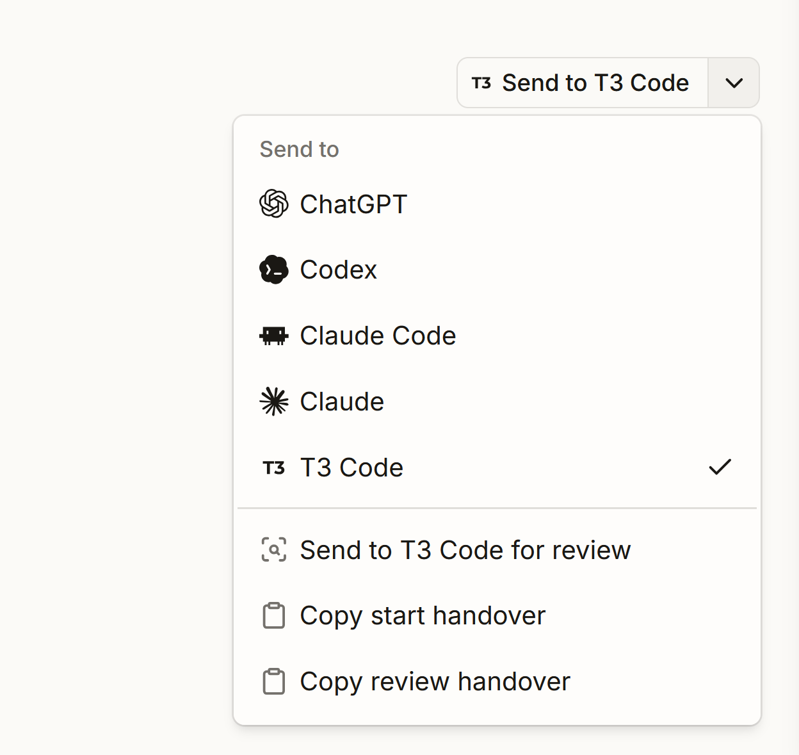
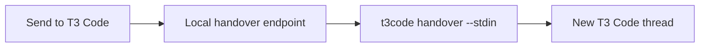

# @bvdm/t3code-cli

`t3code` hands the current folder or Git repository to a new thread in [T3 Code](https://github.com/pingdotgg/t3code), and lets automation discover, inspect, and message existing threads.

It does not fake a handover by copying text or opening a generic app URL. It connects to the running local T3 server, resolves the workspace against T3 projects, optionally creates the missing project, creates a fresh thread, and starts its first prompt through T3's orchestration API.

## Install

Requirements: Node.js 22.16+ and T3 Code.

```bash
npm install --global @bvdm/t3code-cli
```

Then verify discovery and the active T3 server:

```bash
t3code --json doctor
```

## Develop locally

Requirements: Node.js 22.16+ and T3 Code.

```bash
pnpm install
pnpm check
pnpm build
npm link
```

Then verify the linked command:

```bash
t3code --json doctor
```

## Handover

From any folder in a repository:

```bash
t3code handover --prompt "Continue from this handover..."
```

When `--cwd` is omitted, the command starts from the process's current working directory. In the default `repo` workspace mode, that folder then resolves to its Git root.

For larger prompts, pass stdin so shell command-length and quoting rules do not matter:

```bash
printf '%s' "Continue from this handover..." | t3code handover --stdin
```

PowerShell:

```powershell
'Continue from this handover...' | t3code handover --stdin
```

The default behavior is:

- resolve the Git repository root (`workspaceMode: "repo"`); a linked worktree, such as one T3 created for another thread, resolves to the main checkout's project, and a `current` checkout handover keeps the new thread in that worktree;
- create a missing T3 project (`projectPolicy: "create"`);
- resolve T3's checkout preference in the same order as the installed app: project setting, checked-in `t3.json`, then the global setting;
- inherit an existing project's complete model selection, including its provider options;
- use full access for both the new thread and its first turn;
- create a fresh thread and start the prompt through T3's orchestration commands;
- reveal T3 Code after dispatch.

Use `--dry-run --json` to inspect the exact project and thread commands without writing T3 state.

Select the new thread's T3 controls on the handover command:

```bash
t3code handover \
  --provider codex \
  --model gpt-6-astra \
  --speed fast \
  --thinking-effort xhigh \
  --permission full-access \
  --mode build \
  --checkout current \
  --prompt "Continue from this handover..."
```

| Control | Values |
| --- | --- |
| `--provider` | A configured T3 provider instance id, such as `codex` or `claudeAgent` |
| `--model` | A model slug supported by that provider instance |
| `--speed`, `--speed-mode` | `standard`, `fast` |
| `--thinking-effort` | A model-supported value such as `low`, `medium`, `high`, `xhigh` or `max` |
| `--permission`, `--runtime-mode` | `approval-required`, `auto-accept-edits`, `full-access` |
| `--mode`, `--interaction-mode` | `build`/`default`, `plan` |
| `--checkout`, `--env-mode` | `current`/`local`, `worktree`, or T3's configured default via `t3` |

Command flags override the CLI config, which overrides the T3 project's saved model selection. Without either override, the saved selection and its options are passed through unchanged. A newly-created project uses the detected T3 version's default (`gpt-5.4` on 0.0.28 and `gpt-5.6-sol` on 0.0.29 and later).

Speed and thinking effort are stored as model options. T3 applies the option ids supported by the selected provider/model. If `--provider` changes the project's default provider instance, also pass `--model` because provider instance ids can be user-defined and do not imply a model.

## Existing threads

List threads across projects, or restrict discovery by project id or workspace:

```bash
t3code threads list
t3code threads list --status active --cwd .
t3code threads list --status settled --project <project-id>
```

`--status` accepts `active`, `settled`, or `all` (the default). Results include the exact thread id, project, title, model, and update time. Inspect the exact target before sending:

```bash
t3code threads inspect --thread <thread-id>
```

`inspect` prints the workspace and branch, model, turn count, latest turn state, context use, and any approval or question the thread waits on. Its JSON also holds a bounded preview: the 6 most recent messages, with message text limited to 2,000 characters.

Read the conversation itself with `read`. It prints a Markdown transcript grouped by turn, which an agent can read directly:

```bash
t3code threads read --thread <thread-id>
t3code threads read --thread <thread-id> --detail answers --turns 3 --first-turn
t3code threads read --thread <thread-id> --detail full --last-turn --max-chars 1500
t3code --json threads read --thread <thread-id>
```

`--detail` sets how much of each turn to return:

- `answers`: the user's prompts and the turn's final answer.
- `messages` (default): prompts and every assistant message, without reasoning summaries or tool calls.
- `full`: everything, including reasoning summaries, tool calls, changed files, and proposed plans.

`--turns <n>` keeps the last n turns, and `--last-turn` is short for `--turns 1`. `--first-turn` adds the first turn, which holds the original request. `--max-chars <n>` clips each message and tool entry but keeps its start and end. Without it, message text is never shortened.

T3 stores user messages without a turn id. The CLI assigns each one to the turn it started, so a prompt stays with its answer. A message sent during a running turn stays with that turn when the provider folds it in, as Claude does. When the provider queues it instead, as Codex does, it waits as pending until its own turn starts. The CLI tells the two apart by the thread's provider. Messages that no turn has picked up yet appear as a pending group.

The JSON result keeps `data.thread.messages` in turn order and adds `turnIndex` and `textTruncated` to each message. `data.thread.turns` describes each returned turn: its number, state, final message id, and, in `full` detail, its changed files and tool call count. T3 reports the state of the latest turn only, so earlier turns have a `null` state. `data.thread.view` reports the detail level and how many turns were returned or left out. `full` also returns `data.thread.toolCalls` and `data.thread.proposedPlans`. T3 shortens tool output to its first line and keeps at most 500 activities per thread, so very long threads lose their oldest tool calls. Changed files come from T3's checkpoint diff of the workspace, so they include any other edits made there during the turn.

Start a new turn on that thread with one of `--prompt`, `--prompt-file`, or `--stdin`:

```bash
printf '%s' "Review findings from the other thread..." \
  | t3code threads send --thread <thread-id> --stdin
```

Sending to a settled thread requires confirmation. Non-interactive and JSON callers must explicitly opt in with `--wake-settled`:

```bash
printf '%s' "New findings that require more work..." \
  | t3code --json threads send --thread <thread-id> --stdin --wake-settled
```

The send command does not report success from the HTTP response alone. It waits until the exact message is visible in T3's thread projection. Archived threads are rejected.

Add `--wait` to wait for the turn that handles the message and print its reply:

```bash
printf '%s' "Which tests still fail?" \
  | t3code --json threads send --thread <thread-id> --stdin --wait --timeout 540
```

`data.wait.outcome` is one of:

- `completed` or `interrupted`: `data.reply` holds that turn as a transcript, without your own message.
- `error`: the provider could not start the turn; `data.wait.error` says why.
- `needs-attention`: the thread waits for an approval or an answer, listed in `data.pendingRequests`.

The reply uses `--detail answers` unless you pass another level. A finished turn must show on two consecutive polls, two seconds apart, so a Codex turn queued behind a running one is not mistaken for the reply. When the wait times out, the command fails with `THREAD_WAIT_TIMEOUT` and `error.details.sent: true`. Do not resend the message; keep waiting with `threads wait`.

To wait for whatever a thread is doing, for example after a handover:

```bash
t3code threads wait --thread <thread-id> --timeout 540
```

Both waits default to 600 seconds. A waiting command issues its T3 session for the timeout plus two minutes, and revokes it when it ends.

Manage settlement explicitly without starting a new turn:

```bash
t3code threads settle --thread <thread-id>
t3code threads unsettle --thread <thread-id>
```

`settle` refuses a thread with a running/starting session or a pending approval or user-input request. `unsettle` marks the thread manually active but does not send a message or start its provider session. Both commands require the server to advertise the `threadSettlement` capability and wait for the requested lifecycle state to appear in T3's projection before succeeding.

## Settings

```bash
t3code config show
t3code config set projectPolicy existing
t3code config set workspaceMode folder
t3code config set openMode browser
t3code config set threadEnvMode local
t3code config set provider codex
t3code config set model gpt-5.6-sol
t3code config set speedMode fast
t3code config set thinkingEffort xhigh
```

| Setting | Values | Default |
| --- | --- | --- |
| `projectPolicy` | `create`, `existing` | `create` |
| `workspaceMode` | `repo`, `folder` | `repo` |
| `openMode` | `auto`, `desktop`, `browser`, `none` | `auto` |
| `threadEnvMode` | `t3`, `local`, `worktree` | `t3` |
| `runtimeMode` | `approval-required`, `auto-accept-edits`, `full-access` | `full-access` |
| `interactionMode` | `default`, `plan` | `default` |
| `provider` | Configured T3 provider instance id | T3 project selection |
| `model` | Provider model slug | T3 project selection |
| `speedMode` | `standard`, `fast` | T3 project selection |
| `thinkingEffort` | Model-supported effort value | T3 project selection |

`projectPolicy: "existing"` makes a missing project a hard error. `workspaceMode: "folder"` uses the exact current folder instead of walking up to the Git root. `threadEnvMode: "t3"` follows T3's project → `t3.json` → global local/worktree preference. Explicit CLI config values remain overrides.

T3 0.0.28 and later expose an atomic thread bootstrap contract for new worktrees. `--checkout worktree` uses it to create the thread, prepare the worktree from the current branch, run the matching setup script, and start the prompt. T3 only runs that bootstrap for WebSocket RPC clients: its HTTP dispatch route ignores it and rejects the turn because the thread does not exist yet. The CLI therefore sends this one command over T3's `/ws` endpoint, authenticated with a short-lived WebSocket ticket. Like T3's own UI, it asks for a temporary `t3code/<hex>` branch, which T3 renames once the thread has a title. Worktree creation honors the current installation's explicit `newWorktreesStartFromOrigin` value; when that value is absent, it uses the installed version's default (`false` on 0.0.28, `true` on 0.0.29 and later). A repository without a current branch returns `WORKTREE_REQUIRES_BRANCH` instead of silently falling back to the current checkout.

## Commands

```text
t3code --json doctor
t3code config path|show|set
t3code projects list
t3code projects resolve --cwd .
t3code projects ensure --cwd . --project-policy create
t3code threads list --status active --cwd .
t3code threads inspect --thread <thread-id>
t3code threads read --thread <thread-id> --detail answers --turns 3
t3code threads send --thread <thread-id> --stdin --wait
t3code threads wait --thread <thread-id>
t3code threads settle --thread <thread-id>
t3code threads unsettle --thread <thread-id>
t3code threads create --stdin
t3code handover --stdin
t3code request get api/orchestration/shell
```

Every command supports human-readable output. `--json` produces `{ "ok": true, "data": ... }` on success and a stable error envelope on failure. When a failure wraps an upstream CLI error, such as T3's reason for rejecting a worktree bootstrap, `error.cause` carries that error's code, message, and details.

Thread targeting uses exit code `3` for a missing target, `4` for a lifecycle/confirmation refusal, `5` when dispatch returned but turn acceptance could not be verified, and `6` when a wait timed out.

The leading slash of a `request get` path is optional. Git Bash rewrites arguments that start with a slash into Windows paths (`/api/...` becomes `C:/Program Files/Git/api/...`), so write `api/...` there or set `MSYS_NO_PATHCONV=1`.

Authenticated API requests use Node's native HTTP/HTTPS transport to avoid the bundled Undici parser crash on backpressured responses. Each request owns its connection and closes it after completion or failure. The 30-second deadline covers the response body too; truncated bodies return `T3_REQUEST_FAILED`. Redirects are reported as `T3_API_ERROR` rather than followed, and the client does not request compressed responses. Point `--origin` at the T3 server itself.

Responses are still buffered in memory, so available memory limits the largest response. Large JSON output can be piped to a file; the CLI lets output finish before exiting.

## Agent skills

The package ships two skills for coding agents in `skills/`:

- `use-t3code-cli` covers setup, handovers, and the full command set.
- `t3thread` points an agent at an existing thread: `$t3thread <thread-id> <what to do>`. The agent inspects the thread and reads only as much as the instruction needs. It can brief you on the thread, answer questions about it, continue or review its work, or message it and wait for the reply.

Copy or link a skill folder into your agent's skills directory, such as `~/.claude/skills/` for Claude Code or `~/.agents/skills/` for Codex. A global npm install keeps them in `$(npm root -g)/@bvdm/t3code-cli/skills`.

## Origin and optional UI example

This CLI was initially developed for the [Delano viewer](https://github.com/MajesteitBart/delano). Delano's **Send to T3 Code** button lets someone hand browser context directly to a new thread in the T3 Code chat application.





The CLI is the product; a front end is not required. See the optional [integration README](integrations/README.md#why-delano-needed-it) for why Delano needed this handover button and how its browser-to-server-to-CLI flow works. That folder also contains a copyable React split button and Node bridge as one example of integrating `t3code` into another application.

## Desktop navigation

Current stable T3 Code registers `t3code://` but only uses a second launch to reveal its window. The CLI therefore creates the exact thread first and reports `opened.exactThread: false` when it can only reveal today's desktop app. If a T3 build registers the proposed `t3://thread/<threadId>` protocol, `openMode: "auto"` uses it and reports `exactThread: true`. `openMode: "browser"` opens the exact local web route immediately.

## Security

The CLI uses T3's own `auth session issue` control plane to mint an administrative bearer token, keeps it only in memory, and revokes it in a `finally` block. A worktree handover also exchanges that token for a short-lived WebSocket ticket. Tokens and tickets are never included in JSON output or logs.

## Publish a release

Pull requests and pushes run `pnpm check` through [GitHub Actions](.github/workflows/ci.yml) on the minimum supported Node 22 and Node 24 versions.

Publishing uses npm trusted publishing from [publish.yml](.github/workflows/publish.yml). Configure the package's **Trusted Publisher** once in the npm package settings:

| Field | Value |
| --- | --- |
| Provider | GitHub Actions |
| Organization or user | `MajesteitBart` |
| Repository | `t3code-cli` |
| Workflow filename | `publish.yml` |
| Environment | Leave empty |

The workflow uses short-lived OIDC credentials, so it does not need an `NPM_TOKEN` repository secret. It also publishes npm provenance automatically.

To release a new version:

```bash
npm version patch
git push --follow-tags
```

Then publish a GitHub Release for the new `v<package-version>` tag. The workflow verifies that the tag matches `package.json`, installs from the frozen lockfile, runs the complete `prepublishOnly` check, and publishes the public scoped package to npm.
