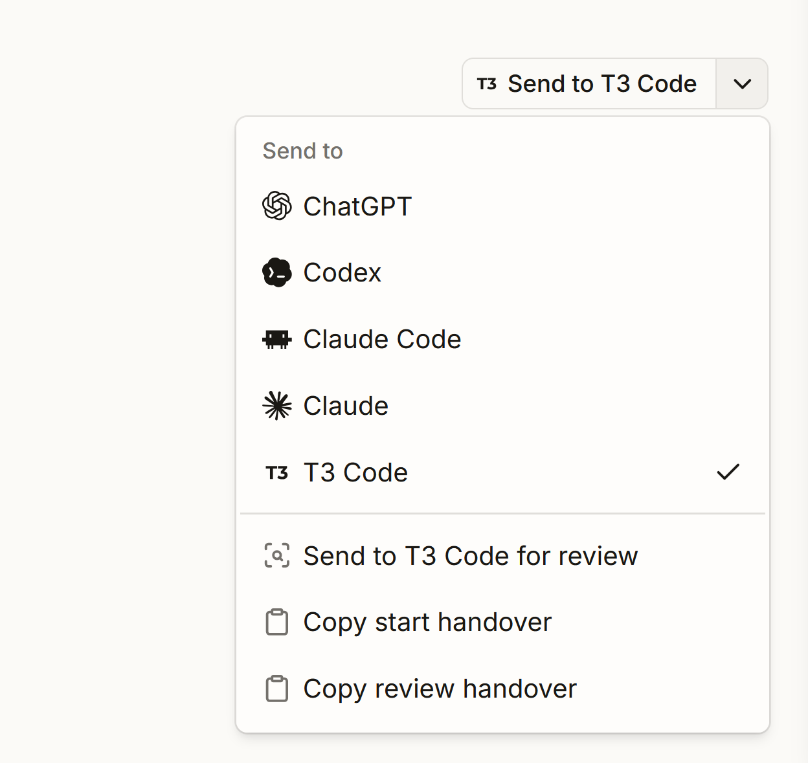

# Optional Send to T3 Code example

This folder is an optional example, not part of the `t3code` CLI runtime or its required setup. It packages the pattern first built for the Delano viewer: a front-end split button asks a trusted local backend to turn the current task or review context into a fresh T3 Code thread.



## Why Delano needed it

Delano is a browser-based project viewer where tasks, workstreams, specifications, and review annotations are already open in the front end. Copying that context by hand into a separate chat was slow and easy to get wrong: the receiving agent also needed the correct repository, source document, intent, and any selected review feedback.

The handover button closes that gap. Delano builds a focused start or review prompt from the current screen, posts it to its trusted local viewer server, and the server invokes `t3code`. The CLI resolves the repository to its T3 project, creates a fresh thread with the selected model and permissions, submits the prompt, and reveals T3 Code. Copy-command actions remain available as a fallback.

The dropdown shown above is Delano's broader agent handover menu. T3 Code is one destination alongside ChatGPT, Codex, Claude Code, and Claude; the integration example in this repository intentionally demonstrates only the T3 Code path.

The copyable example pieces are:

- [`react/SendToT3CodeButton.tsx`](react/SendToT3CodeButton.tsx): dependency-light React split button with current-checkout, worktree, and Plan-mode actions.
- [`react/send-to-t3-code-button.css`](react/send-to-t3-code-button.css): neutral styling matching the compact Delano toolbar treatment.
- [`node/launchT3CodeHandover.mjs`](node/launchT3CodeHandover.mjs): Node bridge that invokes `t3code --json handover`, passes every option as an argument, and writes the prompt to stdin.

## React

Copy the React files into an application, or import them from this repository:

```tsx
import { SendToT3CodeButton } from "./SendToT3CodeButton";

export function TaskActions({ taskPath }: { taskPath: string }) {
  return (
    <SendToT3CodeButton
      request={{
        prompt: `Implement the task at ${taskPath}. Read AGENTS.md first.`,
      }}
      onSuccess={({ data }) => console.log("Created thread", data.thread.id)}
      onError={(error) => console.error(error)}
    />
  );
}
```

The browser posts to `/api/t3code/handover` by default. It cannot and should not launch a local CLI directly.

## Node backend

Adapt this route to Express, Fastify, Hono, or the application's existing HTTP server:

```js
import { launchT3CodeHandover } from "./integrations/node/launchT3CodeHandover.mjs";

app.post("/api/t3code/handover", async (request, response) => {
  try {
    const prompt = buildTrustedHandoverPrompt(request.body);
    const result = await launchT3CodeHandover({
      cwd: repositoryRoot, // selected by the server
      prompt,
      checkout: request.body.checkout === "worktree" ? "worktree" : "current",
      mode: request.body.mode === "plan" ? "plan" : "build",
    });
    response.json(result);
  } catch (error) {
    response.status(400).json({
      ok: false,
      error: { message: error instanceof Error ? error.message : String(error) },
    });
  }
});
```

Keep the repository root server-owned, validate the request, and protect the route like any other local write action. The bridge never concatenates the prompt into a shell command; it sends it to `t3code` over stdin.

## Delano source

The original implementation remains in `E:\Development\delano-1`:

- `.delano/viewer/ui/src/components/molecules/AgentSplitButton.tsx`
- `.delano/viewer/ui/src/components/molecules/HandoverMenu.tsx`
- `.delano/viewer/ui/src/lib/domain/handover.ts`
- `.delano/viewer/server.js` (`launchT3CodeHandover`)

Delano adds annotation bundles, start/review intents, other agent destinations, command-copy fallbacks, and an activity feed. The reusable version here intentionally contains only the T3 Code boundary.
